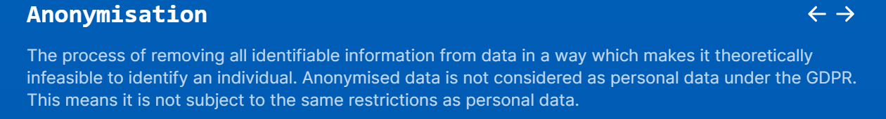
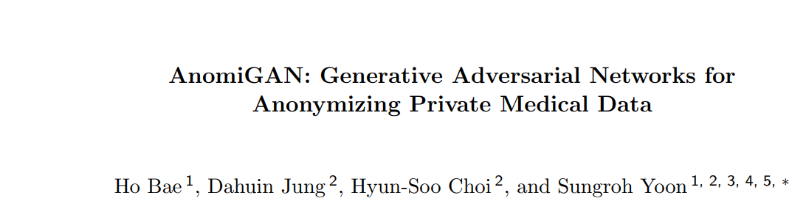

# Overview
---

---
# Anonymisation

- Definition from [NHSX AI dictionary](https://nhsx.github.io/ai-dictionary?term=anonymisation)
- Information Commissioner's Office (ICO) sets out a code of practice for anonymisation. 
- Fundamental law of information recovery: if we can query source mulriple times and it returns accurate information for each query, the underlying data can be reconstructed in full. 

---
# Attacks
Linkage attacks -- different datasets which anonymize different components can be 'linked' to gain identifying information. 

Risk of identification can be quantified
Aim to minimize probability of successful de-anonymization

# Structure of talk

---

- Paper from Korea

--- 
# Differential Privacy
